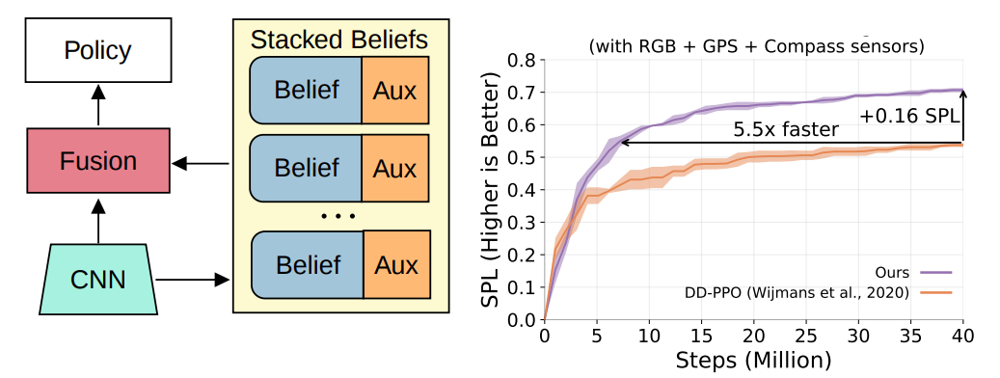

# Auxiliary Tasks Speed Up Learning PointGoal Navigation
<p align="center">
  
</p>

Our code is built off of the [Habitat](https://github.com/facebookresearch/habitat-api/) framework and only changes some files. For a framework overview, please refer to Habitat documentation. This code was last tested with [this commit](https://github.com/facebookresearch/habitat-api/commit/6091d0aedd41d348824252d74119d5d0d3355b8e).

## Requirements
1. Python 3.6+
2. Recommended: [anaconda/miniconda](https://docs.conda.io/en/latest/miniconda.html)

## Installation
Please first initialize the conda environment using the provided `environment.yml` file with

`conda env create -f environment.yml`.

To install Habitat, follow installation guidelines for [habitat-sim](https://github.com/facebookresearch/habitat-sim#installation) and [habitat-api](https://github.com/facebookresearch/habitat-api#installation). No additional packages are used in our paper. This codebase is known to be compatible with https://github.com/facebookresearch/habitat-sim/releases/tag/v0.1.6 (we use headless installation).

### Data
We use the Gibson dataset as distributed by Habitat. You'll need to download the Gibson scene data from [habitat-sim](https://github.com/facebookresearch/habitat-sim#datasets) and the Gibson PointNav data from [habitat-api](https://github.com/facebookresearch/habitat-api#data). Download and extract according to the instructions on the Habitat readmes.

### Pre-trained weights
NOTICE: Note that the reported results have changed since the initial pre-print in Summer 2020.
An early stopped checkpoint for models trained to 40 million frames for the baseline, best single module (reported as "Add" in the paper) (`cpca-id-td_single`) and multi-module (`cpca-id-td_attn-e`) checkpoints are posted [here](https://drive.google.com/drive/folders/17Wcz5PIdD9LTUAt05L8FWjSBM--4vdIJ?usp=sharing). Note that our reported scores were attained by running `./scripts/eval_pn.sh` 3 times and averaging the scores. Once your checkpoints are downloaded, modify the path in `eval_pn.sh` to these paths to get validation metrics.
We get the following numbers:

- `baseline`: .56 SPL.
- `cpca-id-td_single` : .68 SPL.
- `cpca-id-td_attn-e`: .71 SPL.

## Training
You can train the same models using `./scripts/train_pn.sh "variant_name`. The variant configurations are all under `habitat_baselines/config/official_gc`. The datasets used by these configurations are specified by the task configuration under `configs/tasks/pointnav_gc.yaml`.

## Evaluation
You can evaluate a trained checkpoint by configuring the checkpoint path in `./scripts/eval_pn.sh`. To generate videos of your agent, enable `VIDEO_OPTION` in the variant configuration. You can also find settings to adjust what videos are generated inside `ppo_trainer.py`.

## Model Analysis
To generate a json with more detailed evaluation information (e.g. actions taken, agent location per episode), see `run_detailed.py`.

## References and Citation
If you use this work, you can cite it as
```
@misc{ye2020auxiliary,
    title={Auxiliary Tasks Speed Up Learning PointGoal Navigation},
    author={Joel Ye and Dhruv Batra and Erik Wijmans and Abhishek Das},
    year={2020},
    eprint={2007.04561},
    archivePrefix={arXiv},
    primaryClass={cs.CV}
}
```
